# IBM Security Guardium Analyzer Workshop

## Overview

Getting started with [IBM Security Guardium Analyzer](http://ibm.biz/analyzer) for efficiently finding regulated data, understand data and database exposures, and act to address issues and minimize risk.

Refer to slides at: [Hands-On IBM Security GuardiumAnalyzer Bootcamp.pdf](https://github.com/IBM/guardium-analyzer-workshop/blob/master/files/Hands-On%20IBM%20Security%20GuardiumAnalyzer%20Bootcamp.pdf)

**Table of Contents**

- [Getting Started](#getting-started)
  - [Register for Free Trial](#register-for-free-trial)
  - [Create IBM ID](#create-ibm-id)
  - [Setup Database](#setup-database)
    - [Supported Databases](#supported-databases)
    - [Setup DB2 Database](#setup-db2-database)
- [First Time Login to IBM Security Guardium Analyzer](#first-time-login-to-ibm-security-guardium-analyzer)
  - [Setup Insight Settings](#setup-insight-settings)
  - [Download IBM Security Guardium Data Connector](#download-ibm-security-guardium-data-connector)
- [Setup IBM Security Guardium Data Connector](#setup-ibm-security-guardium-data-connector)
    - [Install Data Connector](#install-data-connector)
    - [Launch Data Connector](#launch-data-connector)
    - [Register Data Connector](#register-data-connector)
    - [Setup Default Database Location](#setup-default-database-location)
- [Add First Database to Data Connector](#add-first-database-to-data-connector)
  - [Add Database Connection Details](#add-database-connection-details)
  - [Add Database Scan Preference](#add-database-scan-preference)
  - [Start a Scan](#start-a-scan)
- [View Results of Scan on Guardium Analyzer](#view-results-of-scan-on-guardium-analyzer)
  - [View Dashboard Insights](#view-dashboard-insights)
  - [View Database Vulnerabilities](#view-database-Vulnerabilities)
  - [View Database Patterns](#view-database-Vulnerabilities)
  - [View Registered Data Connectors](#view-registered-data-connectors)
  - [View Settings](#view-settings)
- [Resources](#resources)
- [Contacts](#contacts)

## Getting Started

### Register for Free Trial

1. Navigate to [Guardium Analyzer marketplace page](http://ibm.biz/analyzer). (Link: http://ibm.biz/analyzer) and click  button.

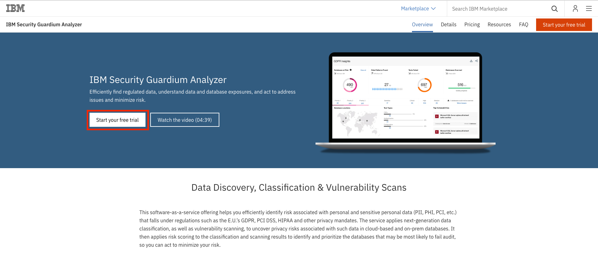

2. After clicking `Start your free trial` you will be navigated to either login with IBM ID or Create a new IBM ID. 

If you do not have an IBM ID follow the steps [Create IBM ID](#create-ibm-id).

If you do have an IBM ID login using your IBM ID. Then continue to [Ready To Use - IBM Security Guardium Analyzer Trial](#ready-to-use-ibm-security-guardium-analyzer-trial)

### Create IBM ID

1. Fill out form presented from step [Register for Free Trial](#register-for-free-trial) in the case you have not already created an IBM ID.

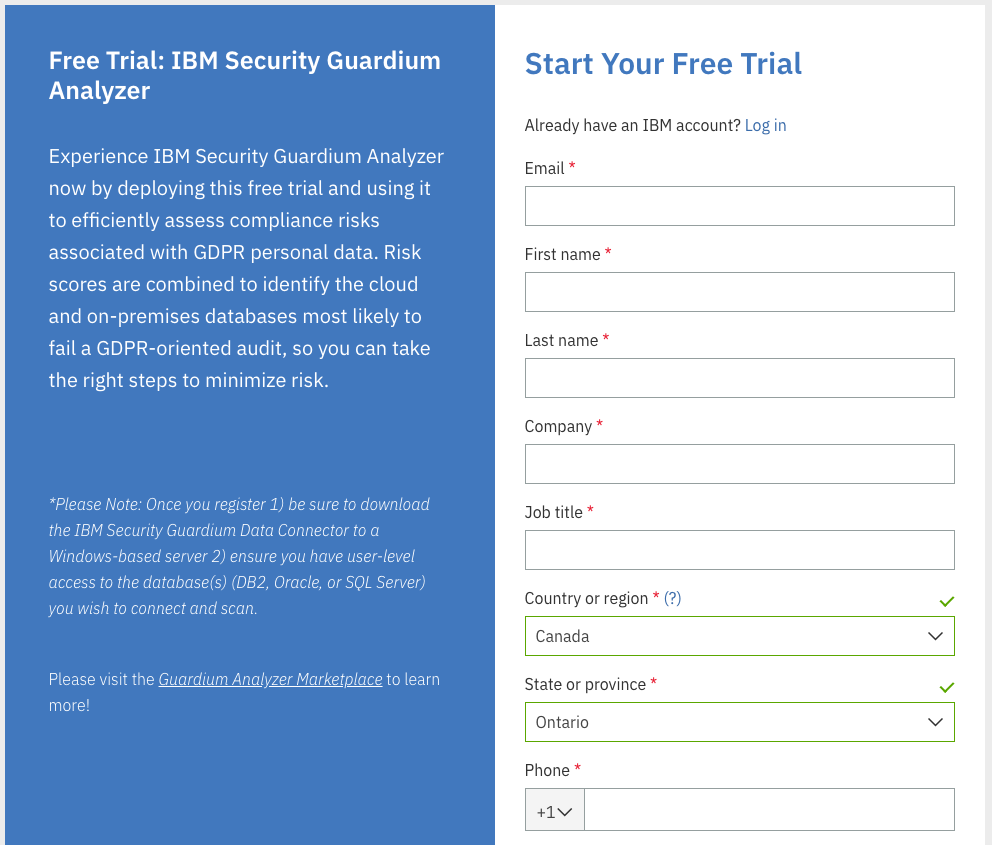

2. Follow the additional steps as part of IBM ID creation including verifying email. 

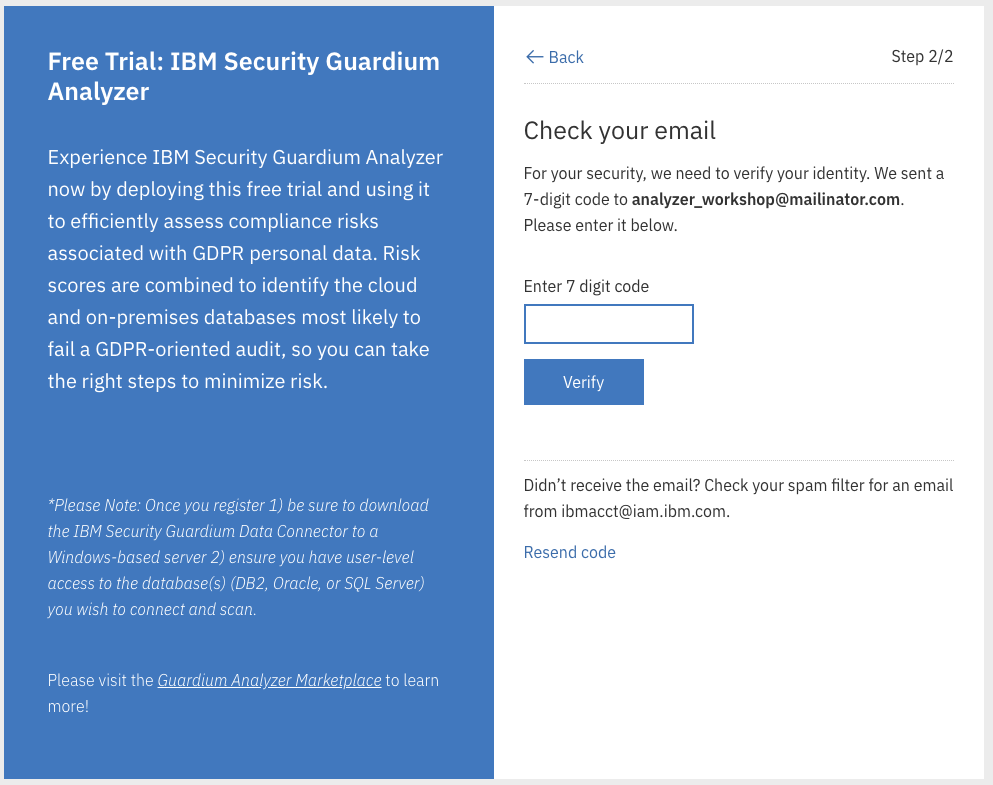

3. Continue to step [Ready To Use - IBM Security Guardium Analyzer Trial](#ready-to-use-ibm-security-guardium-analyzer-trial)

### Ready To Use - IBM Security Guardium Analyzer Trial

1. Once you have successfully registered for `IBM Security Guardium Analyzer Trial` either through the process of `Create IBM ID` or `Login to existing IBM ID` you will receive an email that the service is ready to use.

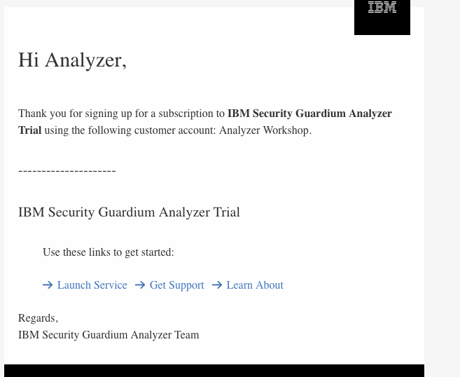

2. Click the  link.

3. This will launch the `IBM Security Guardium Analyzer` Web UI.

Keep this link handy we will get back to this at [First Time Login to IBM Security Guardium Analyzer](#first-time-login-to-ibm-security-guardium-analyzer) step.

### Setup Database

`IBM Security Guardium Analyzer` helps you efficiently identify risk associated with personal and sensitive personal data (PII, PHI, PCI, etc.) that falls under regulations such as the E.U.’s GDPR, PCI DSS, HIPAA and other privacy mandates. The service applies next-generation data classification, as well as vulnerability scanning, to uncover privacy risks associated with such data in cloud-based and on-prem databases.

#### Supported Databases

Guardium Analyzer v1.0 scans on-premises and cloud databases including db2, Oracle, and
Microsoft SQL Server. 

Guardium Analyzer can scan databases that are either installed on an Infrastructure-as-a-Service (IaaS) solution (a cloud VM, for example) or hosted by a cloud provider as long as they are still db2, Oracle or SQL Server.

AWS RDS Oracle is fully tested, and we are testing Azure-MSSQL next.

#### Setup DB2 Database

Note: If you already have a data you would like to scan you can skip the step to setup a DB2 Database and use your own database on-prem or cloud based on [Supported Databases](#supported-databases)

For this workshop we will walkthrough how we can setup a DB2 Database and bootstrap the datababse with `db2sample`

##### Prerequisites

1. Install Docker: [Docker](https://www.docker.com/community-edition)
2. A Ubuntu 16.04.5 LTS physical or VM image (this what will use for this workshop)

##### Pull down DB2 Express C

```bash
$ docker run -it -p 50000:50000 -e DB2INST1_PASSWORD=db2inst1-pwd -e LICENSE=accept   -v  $(pwd):/share  ibmcom/db2express-c:latest bash
```

-p 50000:50000 exposes port 50000 to allow connections from the remote client.

By specifying -e DB2INST1_PASSWORD=db2inst1-pwd parameter, you set a password of your choice for the db2inst1 user for the default DB2 instance.

By specifying -e LICENSE=accept parameter, you are accepting this License to use the software contained in this image.

/share, referring to mount point at "/share" in the Docker.

$(pwd), the current directory on Docker host while running Docker command, which is mounted by Docker container. It can also be any existing directory on Docker host, like /tmp, /opt, etc.

##### Start DB2 and create sample DB

Note: You will be running these with in the DB2 Express C docker container

1. Login to `db2inst1` account

```bash
$ su - db2inst1
```

2. Start DB2

```bash
$ db2start
```

Should see `SQL1063N  DB2START processing was successful.` on a succesful DB2 Start.

3. Create a DB2 Sample Database

```bash
$ db2sampl
```

Should see the following on a successful DB2 Sample Database creation:

```

  Creating database "SAMPLE"...
  Connecting to database "SAMPLE"...
  Creating tables and data in schema "DB2INST1"...
  Creating tables with XML columns and XML data in schema "DB2INST1"...

  'db2sampl' processing complete.

```

4. Connect to DB2 Sample Database

```bash
$ db2 connect to sample
```

On a successful connection you should see: 

```
   Database Connection Information

 Database server        = DB2/LINUXX8664 10.5.5
 SQL authorization ID   = DB2INST1
 Local database alias   = SAMPLE
```

Note: Keep this terminal active as this will keep DB2 active and exposed to the network to access it. We will scan this database using the `IBM Security Data Connector`.

## First Time Login to IBM Security Guardium Analyzer

Now lets go back to where we left of from the [Ready To Use - IBM Security Guardium Analyzer Trial](#ready-to-use-ibm-security-guardium-analyzer-trial).

This will be the link to the `IBM Security Guardium Analyzer` Web UI which will login to.

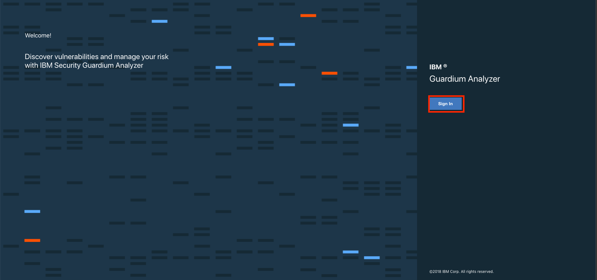

### Setup Insight Settings

1. After long you will be navigated to the `Welcome!` page where you can go ahead and click 

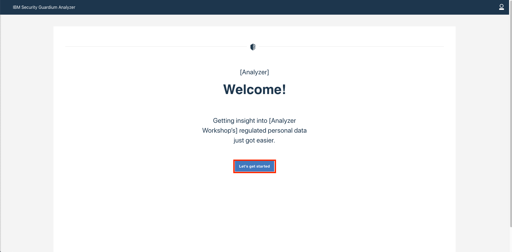

2. Now choose a frequence to receive insights and then click 

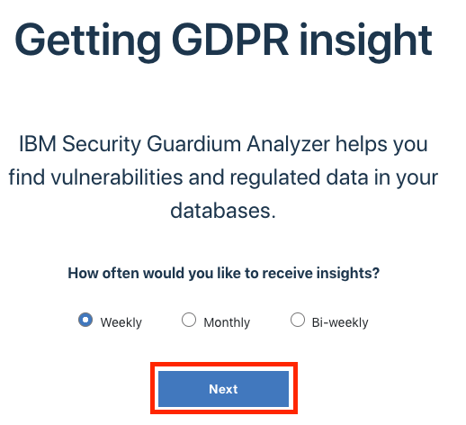

3. Continue to [Download IBM Security Guardium Data Connector](#download-ibm-security-guardium-data-connector) step.

### Download IBM Security Guardium Data Connector

At this point you will already be at the `Connect databases` page where you can download the `Data Connector`.

On this page you will be provided the Video and Guide to walkthrough setting up `Data Connector` as well.

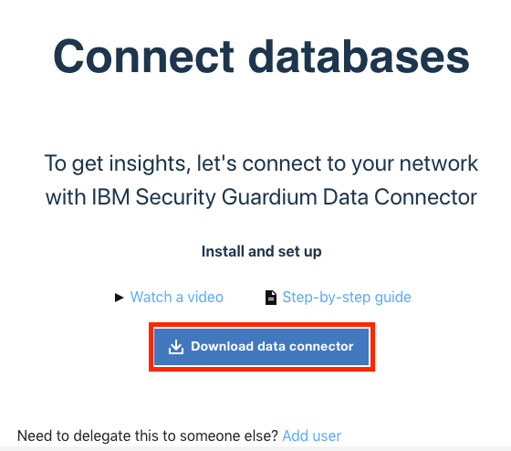

Continue to the [Setup IBM Security Guardium Data Connector](#setup-ibm-security-guardium-data-connector) step to setup the `Data Connector`.

Note: Can also download `Data Connector` using link: http://ibm.biz/connector

## Setup IBM Security Guardium Data Connector

Unzip Data Connector package that was download from [Download IBM Security Guardium Data Connector](#download-ibm-security-guardium-data-connector) step on to a Windows server.

### Install Data Connector

1. Run the `Setup.exe`

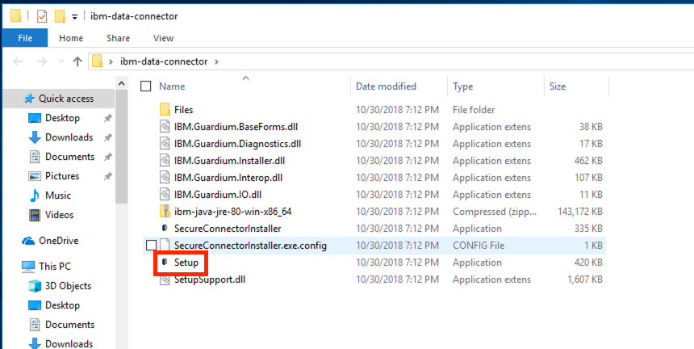

2. Select the default install location and follow the on-screen menus to finish the install.

3. Continue to [Launch Data Connector](#launch-data-connector) step.

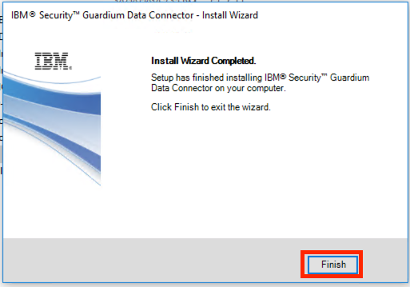

### Launch Data Connector

1. Once clicked `Finish` in [Install Data Connector](#install-data-connector) step will be asked to browse to the login page now click 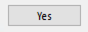

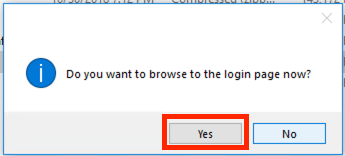

2. Once the `Data Connector` Login page loads continue to [Register Data Connector](#register-data-connector) step.

### Register Data Connector

Note: You will have on page https://localhost/SecureConnector on the Data Connector page at this point.

1. Click the  button.

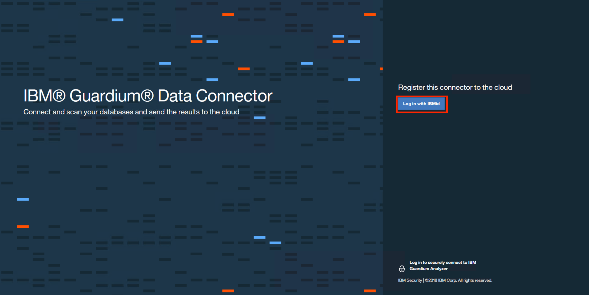

Note: Make sure to login with the same IBM ID that you used in [First Time Login to IBM Security Guardium Analyzer](#first-time-login-to-ibm-security-guardium-analyzer).

2. Once logged in you will be directed to the `Register` page to register the `Data Connector` with `Guardium Analyzer`. Fill in a unique name for this Data Connector.

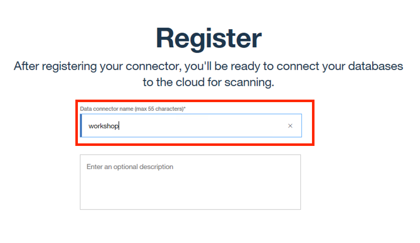

3. Click  button once it is enabled.

4. Once Register is successful continue to [Setup Default Database Location](#setup-default-database-location) step.

### Setup Default Database Location

1. Setup the default database location as `Canada` and click  

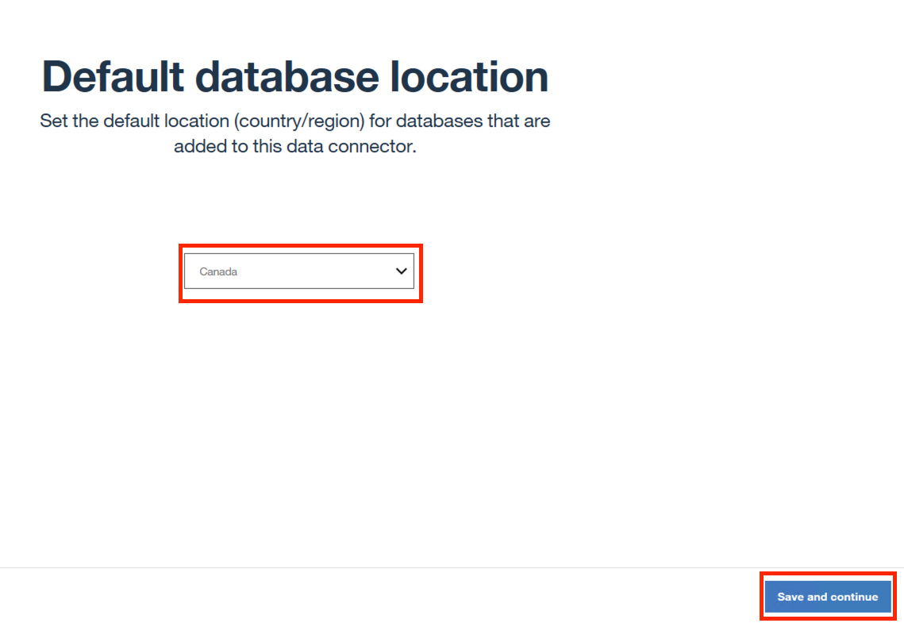

2. Once the default database location is set continue to [Add First Database to Data Connector](#add-first-databbase-to-data-connector)

## Add First Database to Data Connector

Now we will add a database to the `Data Connector` to scan for vulnerbilities, find reglatory data and have the results upload to `Guardium Analyzer`.

### Add Database Connection Details

Going back to [Setup DB2 Database](#setup-db2-database) where we setup our DB2 Database that we want to scan. (At this step you can point it to any database which is supported based on [Supported Databases](#supported-databases)).

1. Fill in the database connection information and Country (if Country is not specified, will use Default Location given on previous page).

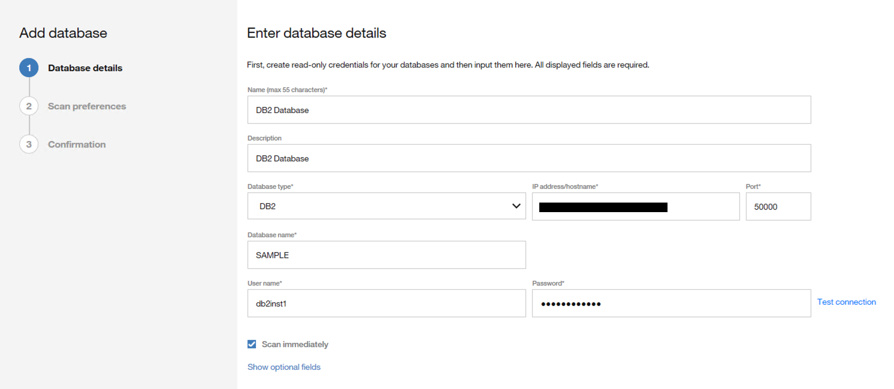

Note: Following will be the information you will fill in based on what we configured for DB2 above.

```
Database type: DB2
IP address/hostname: 127.0.0.1 // Since we are running on a VM with in the same machine. Can be a real hostname or IP address as well.
Port: 50000
Database name: SAMPLE
User name: db2inst1
Password: db2inst1-pwd
```

2. Click the 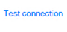 link to make sure connection to the Database works.

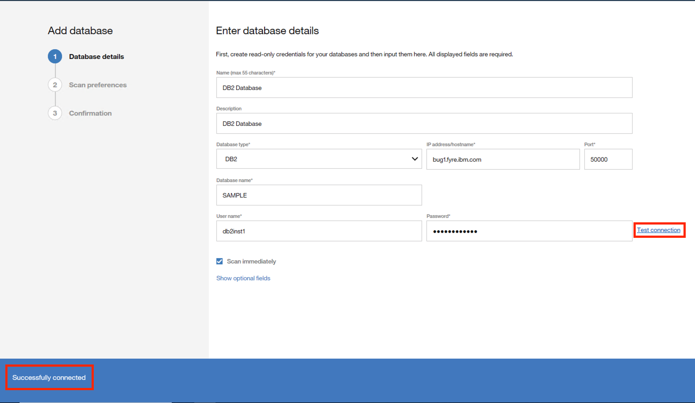

3. Once everything is filled in and connection works click 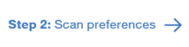 link.

4. Continue to [Add Database Scan Preference](#add-database-scan-preference) step.

### Add Database Scan Preference

1. Specify which time frames you would like the `Data Connector` to scan the specific database. Click 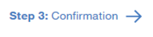 link.

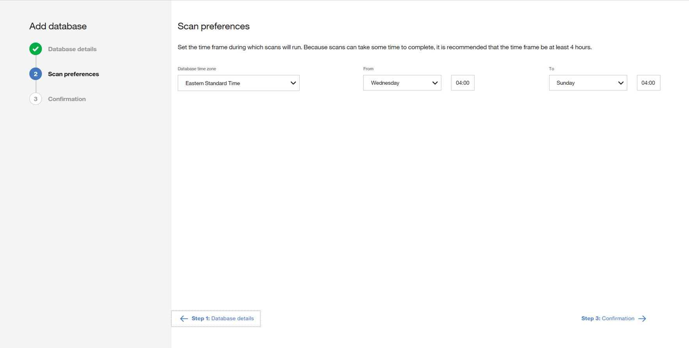

2. Verify the details are correct and everything is successful in the workflow for adding a database.

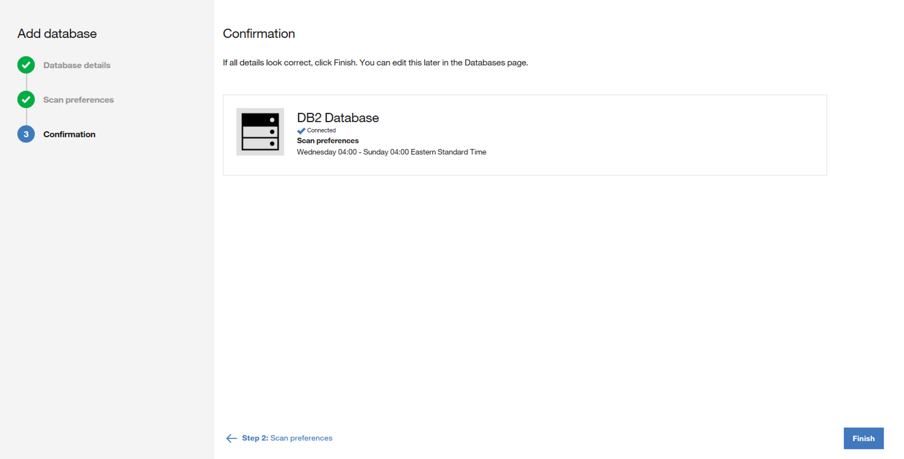

3. Click  button.

4. Continue to [Start a Scan](#start-a-scan) step.

### Start a Scan

At this point the scan for the datababse that was just added will automatically be started.

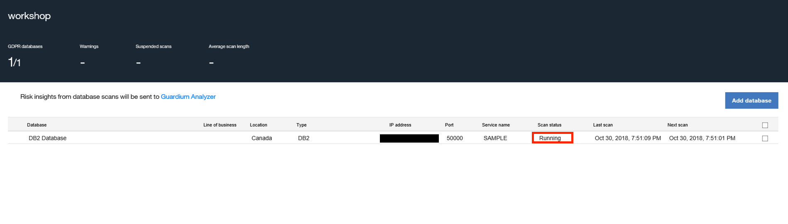

Note: Above view can also be used to View and manage databases.

## View Results of Scan on Guardium Analyzer

Once the scan is done on the `Data Connector` we can go back to the `Guardium Analyzer` Web UI.

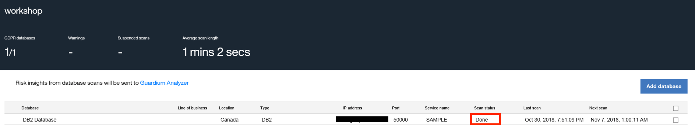

### View Dashboard Insights

1. Navigate to [Dashboard Insights Page](https://www.datarisk.dsoc.ibm.com/serviceui/dashboard) (Link: https://www.datarisk.dsoc.ibm.com/serviceui/dashboard).

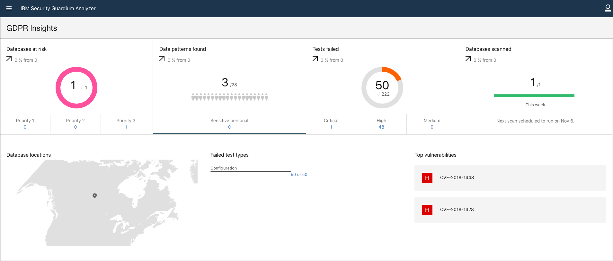

Note: Refer to [Viewing risk insights on the cloud](https://www.ibm.com/support/knowledgecenter/SS2RDF/GuardiumAnalyzer/cloud_insights_gdpr.html#cloud_insights_gdpr) for more details on how to understand this screen.

### View Database Vulnerabilities

1. Navigate to [Database Page](https://www.datarisk.dsoc.ibm.com/serviceui/databases) (Link: https://www.datarisk.dsoc.ibm.com/serviceui/databases).

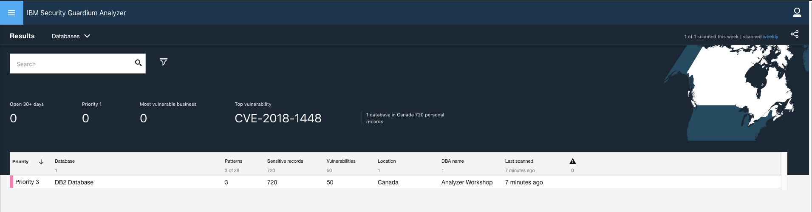

Note: Refer to [Viewing database results on the cloud](https://www.ibm.com/support/knowledgecenter/SS2RDF/GuardiumAnalyzer/cloud_results_databases.html#cloud_results_databases) for more details on how to understand this screen.

2. Database Vulnerbilities once clicked on the database from above

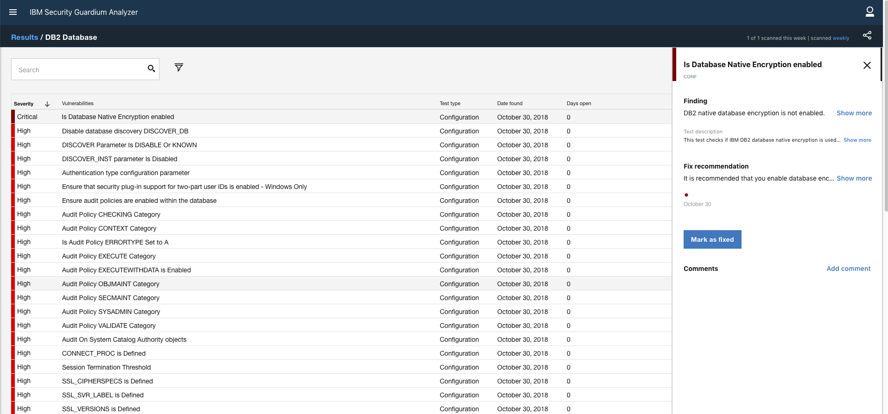

### View Database Patterns

1. Navigate to [Patterns Page](https://www.datarisk.dsoc.ibm.com/serviceui/patterns) (Link: https://www.datarisk.dsoc.ibm.com/serviceui/patterns).

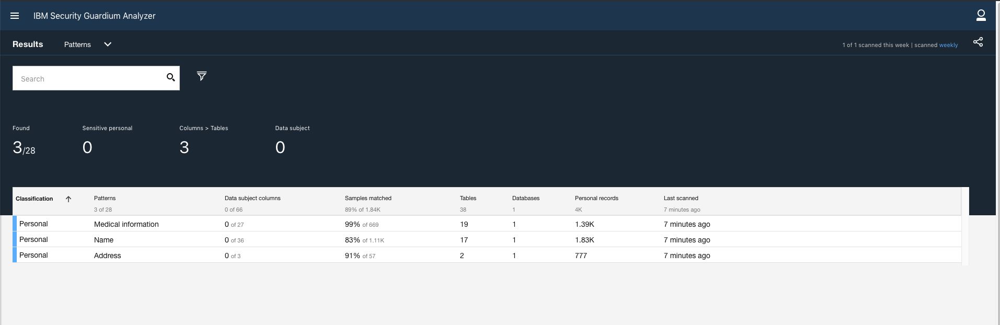

Note: Refer to [Viewing patterns that have been found in your databases](https://www.ibm.com/support/knowledgecenter/SS2RDF/GuardiumAnalyzer/cloud_results_patterns.html#cloud_results_patterns) for more details on how to understand this screen.

2. Where do my patterns exist


Note: Refer to [Viewing the results for a single pattern](https://www.ibm.com/support/knowledgecenter/SS2RDF/GuardiumAnalyzer/cloud_results_patterns_ptn.html#cloud_results_patterns_ptn) for more details on how to understand this screen.

### View Registered Data Connectors

1. Navigate to [Data Connector Page](https://www.datarisk.dsoc.ibm.com/serviceui/connectors) (Link: https://www.datarisk.dsoc.ibm.com/serviceui/connectors).

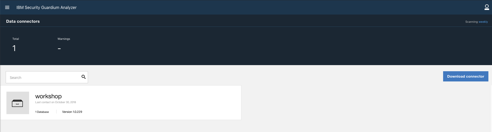

Note: Refer to [Viewing all connectors](https://www.ibm.com/support/knowledgecenter/SS2RDF/GuardiumAnalyzer/cloud_sc.html#cloud_sc) for more details on how to understand this screen.

### View Settings

View settings that can be configured or changed.

1. Navigate to [Settings Page](https://www.datarisk.dsoc.ibm.com/serviceui/settings) (Link: https://www.datarisk.dsoc.ibm.com/serviceui/settings).

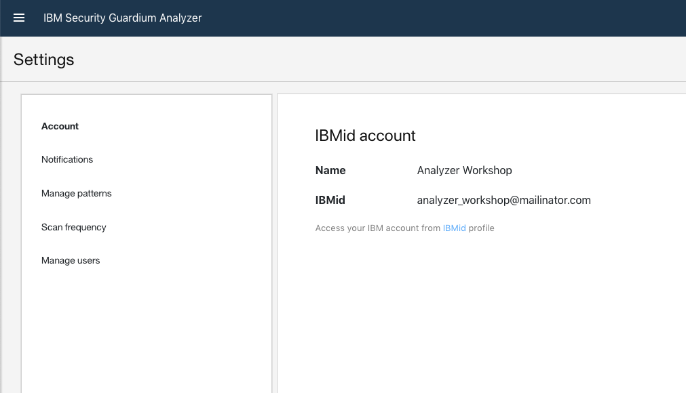

Note: Refer to [IBM Security Guardium Analyzer settings](https://www.ibm.com/support/knowledgecenter/SS2RDF/GuardiumAnalyzer/cloud_settings.html) for more details on how to understand this screen.

## Resources

- [Guardium Analyzer marketplace page](https://www.ibm.com/us-en/marketplace/guardium-analyzer)
  - View capabilities and subscription options
- [Free trial](https://www.ibm.com/us-en/marketplace/guardium-analyzer/purchase#product-header-top)   
- [Guardium Analyzer Data sheet](https://www-01.ibm.com/common/ssi/cgi-bin/ssialias?htmlfid=53015653USEN&)
- [Overview Guardium Analyzer demo video](https://www.youtube.com/watch?v=8NQDTf91aIc)
- Product tutorial series:
   - [Getting started with the Data Connector](https://www.youtube.com/watch?v=B3zKYbPdqjo)
   - [Adding users to Guardium Analyzer](https://www.youtube.com/watch?v=Cw7Nmkc4kZ8)
   - More to follow!
- [Getting Started Guide/FAQ](https://www-01.ibm.com/common/ssi/cgi-bin/ssialias?htmlfid=04016704USEN&)
- [Webcast replay: After the GDPR Enforcement Date: Myths, Realities, and What to Do Now](https://securityintelligence.com/events/after-the-gdpr-enforcement-date-myths-realities-and-what-to-do-now/)
- [Webcast: Analyzing Your GDPR Readiness: The Core Data Protection Capabilities You Need](https://securityintelligence.com/analyzing-your-gdpr-readiness-the-core-data-protection-capabilities-you-need/)

## Contacts

Devan Shah (devans@ca.ibm.com ) - Software Developer, IBM Data Security

Larry Lindsay (llindsay@ca.ibm.com) - Senior Development Manager, IBM Security and Accessibility
